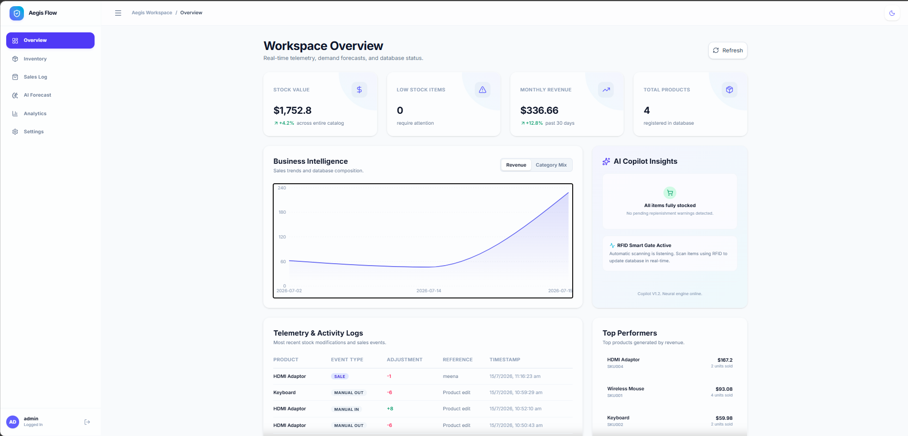
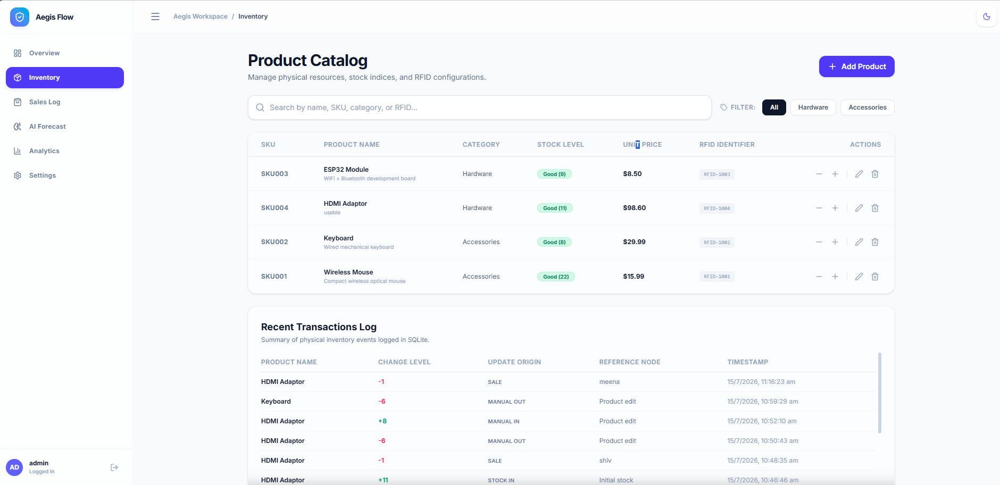
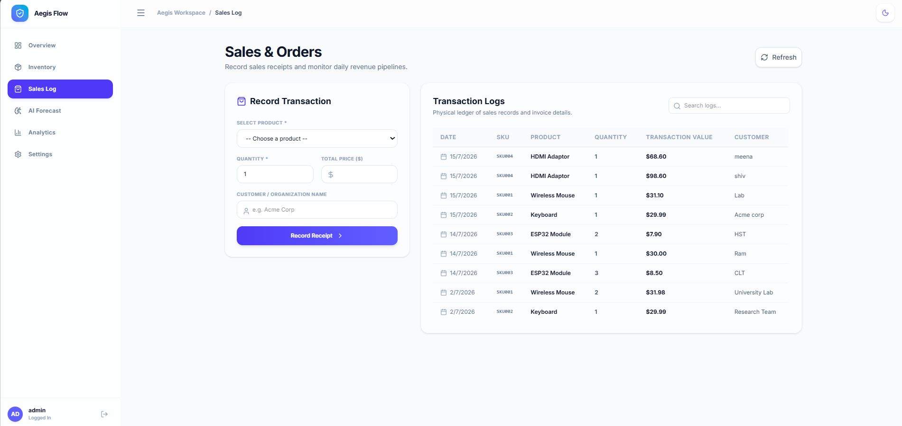
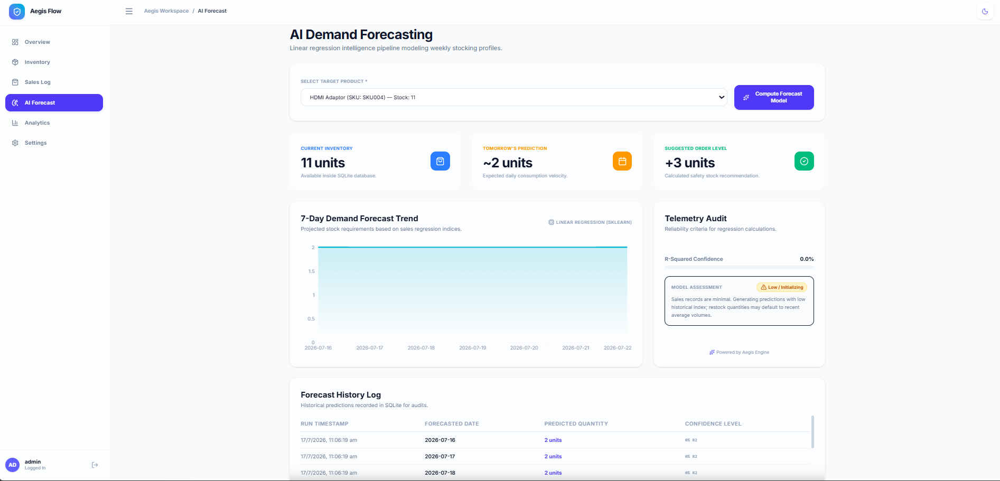
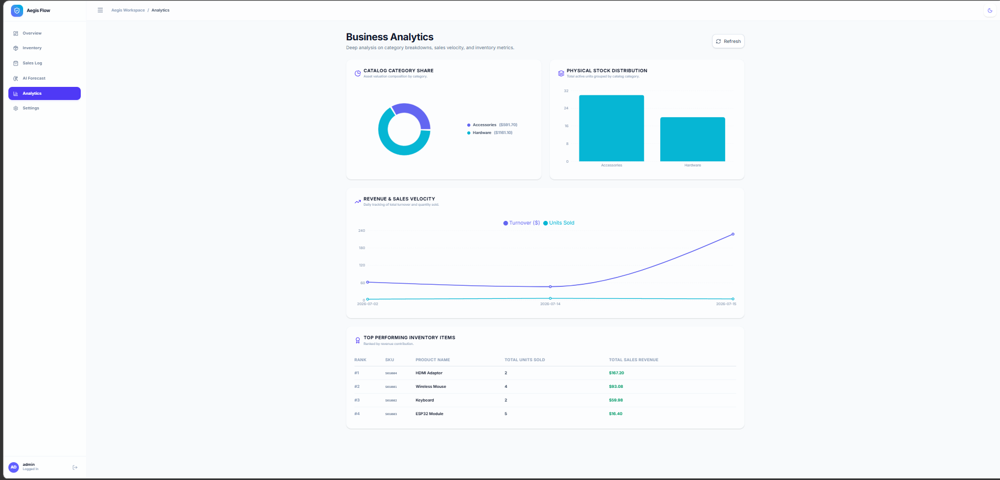
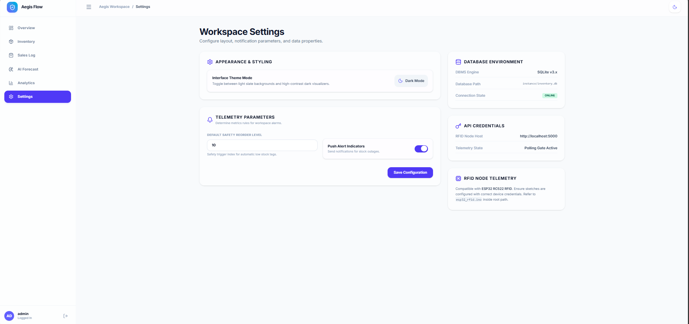

# 🚀 AI Smart Inventory System

A modern AI-powered Inventory Management System that combines inventory tracking, sales management, RFID integration, analytics, and machine learning-based demand forecasting into a single intelligent dashboard.

The application features a modern React frontend, Flask backend, SQLite database, and AI-powered forecasting to help businesses monitor inventory efficiently and make smarter restocking decisions.

---

## ✨ Features

### 📦 Inventory Management
- Add, edit, update, and delete products
- Product search and filtering
- RFID UID support
- Stock quantity management
- Inventory activity logs

### 💰 Sales Management
- Record product sales
- Customer information tracking
- Automatic stock deduction
- Sales history
- Revenue tracking

### 📈 AI Demand Forecasting
- Machine Learning demand prediction
- Product sales forecasting
- Forecast confidence scores
- Inventory planning support

### 📊 Analytics Dashboard
- Inventory value
- Monthly revenue
- Product statistics
- Interactive charts
- Business insights

### 📡 RFID Integration
- ESP32 + RC522 RFID support
- Automatic inventory updates
- Real-time RFID scanning

### ⚙️ Settings
- System configuration
- Database information
- RFID configuration
- Theme settings

---

# 🛠️ Technology Stack

## Frontend

- React
- Vite
- TypeScript
- Tailwind CSS
- JavaScript

## Backend

- Python
- Flask

## Database

- SQLite

## Machine Learning

- Scikit-learn
- Pandas
- NumPy

## Hardware

- ESP32
- RC522 RFID Reader

---

# 📂 Project Structure

```
AI_Smart_Inventory_System
│
├── frontend/
├── ml/
├── models/
├── routes/
├── static/
├── templates/
├── utils/
├── instance/
│
├── app.py
├── database.py
├── config.py
├── requirements.txt
├── schema.sql
├── sample_data.sql
└── README.md
```

---

# 🚀 Installation

Clone the repository

```bash
git clone <repository-url>
```

Navigate into the project

```bash
cd AI_Smart_Inventory_System
```

Create a virtual environment

```bash
python -m venv venv
```

Activate it

Windows

```bash
venv\Scripts\activate
```

Install dependencies

```bash
pip install -r requirements.txt
```

Initialize the database

```bash
python database.py
```

Run the Flask application

```bash
python app.py
```

Open your browser

```
http://127.0.0.1:5000
```

---

# 📊 Modules

- Dashboard
- Inventory
- Sales
- AI Forecast
- Analytics
- Settings

---

# 🤖 AI Features

- Inventory demand forecasting
- Revenue analysis
- Sales trend prediction
- Inventory insights
- Business intelligence dashboard

---

# 📷 Screenshots

## Dashboard



---

## Inventory



---

## Sales



---

## AI Forecast



---

## Analytics



---

## Settings



---

# 👨‍💻 Developed By

Minitha

B.Tech Computer Science & Engineering

---

# 📄 License

This project is developed for educational and academic purposes.